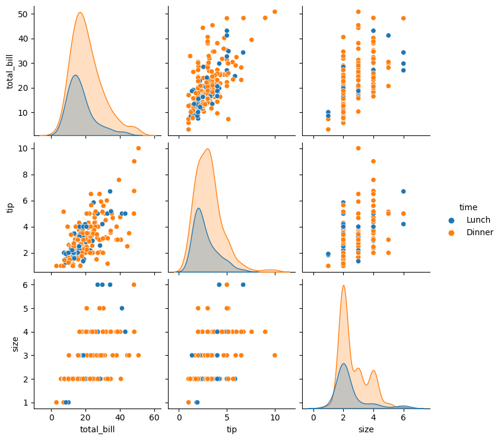
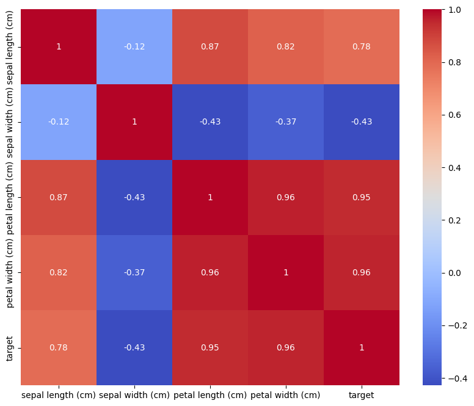

#  Cloud-Hosted Notebooks

  Welcome to my project! This repository contains all the code and resources related to the project.

## Getting Started
### Prerequisites
  A Google account for accessing Google Colab.
  Basic knowledge of Python and data manipulation libraries.
### Setting up the Notebook
  Open Google Colab: Visit Google Colab and sign in with your Google account.
  Create a New Notebook: Click on New Notebook to start a new Jupyter notebook.
  Clone the GitHub Repository: (Optional) If the notebook is hosted on GitHub, you can clone it directly into Google Colab.

## Main Code
```
import pandas as pd
import seaborn as sns
import matplotlib.pyplot as plt
from sklearn.datasets import load_iris
```
```
# Pairplot to visualize relationships
sns.pairplot(df, hue="target")
plt.show()

# Correlation heatmap
plt.figure(figsize=(10, 8))
sns.heatmap(df.corr(), annot=True, cmap='coolwarm')
plt.show()
```

## Result
  Relationships
  
  Heatmap
  


